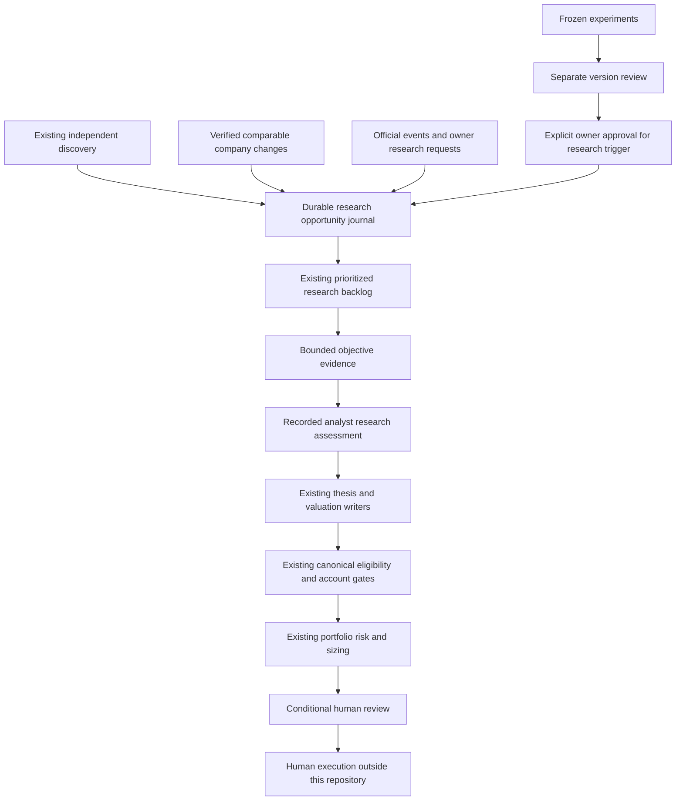

# Equity Research — discovery, research attention and capital boundaries

This is a staged architectural addition to the existing deterministic workflow.
It does not replace the market collector, company fact selector, thesis/valuation
writers, risk engine, portfolio construction or sender. Verify actual runtime
receipts through `current_documents.md`; a schedule or source commit is not proof
of a production run.

## Diagnosis and resulting flow

Broad discovery already ranks exchange-listed common stocks and ETFs independently
of holdings. Its adjusted bars and heuristic strength/volume ranking are separate
from the 31-symbol unadjusted canonical market contract. Before this change, the
shortlist was published but substantive backlog membership came from existing
financial rows and long-horizon companies. A discovery such as MXL could remain
outside research indefinitely. The latest discovery cache also could not preserve
the original detection context.



There is no experiment, opportunity, paper outcome or research score → order
path. An outside-universe company can be researched without modifying the seed,
canonical market/fundamental tables or eligible proposal lists. Research support
does not establish business quality, reviewed valuation or funding readiness.

## Ownership and authoritative contracts

| Owner | Contract / maintained state | Consumers and permitted influence |
|---|---|---|
| Existing runtime/refresh schedulers | slot reservations, runtime/pipeline locks, passed-window handoff | bounded execution of the existing no-send refresh; normal delivery retains its current checks |
| Existing discovery / canonical collector | checksummed independent adjusted discovery; exact canonical unadjusted trio | discovery informs attention; canonical trio remains the sole current order-price input |
| `opportunity_contract.py` | validated observations, transition ownership, source receipts, append-only journal | durable research identity and lifecycle only |
| `opportunity_triggers.py` | adapters using existing discovery, SEC source facts, official events and reviewed experiment versions | market/business/catalyst/request evidence remains separate; no blended conviction score |
| `research_opportunities.py` | capacity, priority, timing, idempotency and validated derived views | attention and research visibility; held/adverse work can displace lower-priority attention without deleting it |
| Existing `research_backlog.py` | gap/attempt history and canonical additive financial writer | routes admitted outside discoveries to isolated evidence work; existing held/unknown-held behavior preserved |
| `opportunity_evidence.py` | exact public SEC bytes and validated research-only issuer dossiers | reuses production financial selector; zero canonical fields, thesis versions, valuations or account changes |
| `update_research_assessment.py` | validated source-bound analyst conclusions and counterevidence | progressive research conviction; rejects unsupported support and requires a separate economic review before eligibility-review handoff |
| `update_experiment_research_approval.py` | owner instruction, complete version review, exact policy/registered Git binding | research use only; never changes experiment history, risk or strategy eligibility |
| Existing thesis, valuation, account, portfolio and daily decision | their existing reviewed contracts and private authoritative stores | sole business/economic/capital authority; new research views do not replace their admission checks |
| `opportunity_measurement.py` / existing experiment evaluation | frozen first-observation horizons/cost sensitivities and source-bound forward outcomes | software/routing and prospective hypothetical-path measurement, separate from investment-performance evidence |
| Existing decision/status/report/email/dashboard | final decisions and separately labelled research views | presentation only; action email sections and normal notification authority are unchanged |

`04_research/company_research/opportunities.local/store.json` is the durable source
of research lifecycle state. The atomically replaced JSON contains the whole
hash-chained append-only journal; every publication verifies the original prefix,
source bytes, timestamps and transition ownership. Exact generations, assessments
and raw inputs remain in its private history. `report.json` and the current
Markdown report are disposable projections, bound to that store's current hash.
They are not sources of capital decisions. Latest failed/killed/incomplete stage
markers cannot be hidden by a previous green report.

The intake policy owns capacity and research expiry only. Existing active config
still owns the objective issuer budget; the new stage consumes the remaining
budget after the existing canonical pass. Existing exchange-session helpers,
SEC selectors, source-fact validators, experiment registry and capital rules are
reused, not independently redefined. The active-input registry explicitly labels
the new optional research contracts. Before first migration, their absence is
allowed; malformed history is not fabricated or reset.

## Invariants

Research attention ≠ capital authority. Early opportunity ≠ buy. Market strength
≠ business quality. Data confidence ≠ conviction. Observation ≠ candidate.
Candidate ≠ trade. Paper/simulated position ≠ broker position. High score ≠
execution authority. Mature experiment ≠ automatic promotion. Missing coverage
is unknown, not a negative observation. Every production recommendation still
requires the existing evidence, account, order, capital, risk, sizing, price and
human-execution contracts. The approved planning basis, zero mandatory internal
reserve and allocation/risk settings remain governed by the current
[owner-approved allocation policy](allocation_policy.md), rather than frozen
by this architecture. The October 6 policy supersedes earlier numerical targets
and fixed name caps without granting the research queue trading authority.

## State transitions and blockers

| Transition | Owner and evidence | Side effects / reversal |
|---|---|---|
| first detection → deferred/queued | orchestration; immutable observation, producer commit/file/policy hashes and retained original source bytes | one ticker task; first-seen and original price/context never overwritten; deferred work competes within capacity |
| queued/data-blocked → researching | objective layer; recorded source-inspection start | bounded work only; failure preserves attempt and precise dependency |
| researching → evidence-attached | objective layer; validated primary identity, selected period, sources and field provenance | research-only numeric attachment; missing values remain missing |
| active → data-blocked | objective layer; missing/stale/unverified source or changed evidence | reversible when evidence changes; no adverse business conclusion or account blocker is cleared |
| evidence-attached → research-supported / insufficient / rejected / economics-failed | analyst writer; dated hypothesis, supporting facts, counterevidence, distinct confidence/conviction, next review and immutable proposal | retained assessment; research support cannot amend a production thesis or valuation |
| research-supported → eligibility-review | analyst writer plus recorded reviewed economics | handoff dependency only; canonical admission and existing production gates still required |
| active → expired | orchestration; five completed published sessions without changed evidence, excluding held attention | no revived entry price/order; original observation and unfinished work stay retained |
| rejected/expired/economics-failed → insufficient | recorded analyst reassessment | explicit reason and sources; no reset of first-seen evidence or position purpose |

New changed evidence on a closed opportunity is surfaced in a bounded reassessment
queue. It does not silently undo its rejection/expiry. Capital data/risk blockers
continue to be owned by the production contracts; the research report does not
invent a second eligibility state machine or duplicate their business rules.

Each packet records family, trigger, actual capture clock, availability, price
basis when present, original market context, source hashes/locators, producer
binding and missing evidence. Market packets retain the existing research queue
at detection as a labelled baseline. A later baseline change is not a new market
signal. Repoll timestamps do not create new business/catalyst evidence. Prices
are EOD observations; live trigger, float, consensus estimates and execution
readiness remain unverified when the existing data cannot establish them.

## Bounds and positive acceleration

The initial workload configuration admits at most six attention tasks per intake,
keeps 24 active, considers the existing ten-stock shortlist plus three ETFs, and
requests at most two new outside issuers per network-enabled objective stage.
Each outside issuer/session request is reserved durably before HTTP; crashes and
failures cannot cause repeated requests on intervening scheduler ticks. Requests
use the existing operator SEC user agent, fixed public submissions/companyfacts
endpoints, response/time limits and no redirects or retries. Local reuse never
starts an additional outside-issuer request. No subscription, model service,
scheduler or broker connection is added.

These are initial workload safeguards, not profitable strategy parameters. The
existing ten-issuer objective ceiling remains authoritative; unchanged packets
and already attached fresh dossiers do not consume useful work slots. Held and
known adverse-event work receives priority; unknown event direction remains
unknown. ETF structure/prospectus review is a separate dependency, not guessed
from the stock financial selector.

Period-bound comparable quarterly revenue-growth acceleration and net-margin
improvement can increase research priority. The adapters reuse the existing
source-fact validator, exact prior quarter, units, official availability and
the existing five-percentage-point review thresholds symmetrically. They do not
add a score or assert an optimal trigger. TTM FCF observations remain available
for analyst assessment, but absent comparable FCF history, consensus revisions,
demand data and earnings-surprise expectations cannot create an acceleration
claim. Changing thresholds is not justified by a short return streak.

SEC API response bytes and selection provenance are retained. See the dated
[SEC API documentation](https://www.sec.gov/search-filings/edgar-application-programming-interfaces):
API data is updated as filings are disseminated, which does not establish future
availability or quarter comparability. Source acceptance, period and coverage
checks remain necessary.

## Experiments and prospective measurement

Existing frozen policies, implementations/import closures, horizons, cost grids,
observations, unsuccessful/missed setups, missing outcomes and review batches
are unchanged. `momentum_reproducibility.md` remains authoritative for replay.
Unapproved observations appear as review-only diagnostics. Research approval
requires exact version/policy identity, a complete matching review, retained
explicit owner instruction and a verified registered immutable Git closure.
Approval is not manufactured from readiness, profitability or a winning streak.
The approval validator rebuilds the review from all five retained original input
files and checks its policy against the registered immutable implementation. A
manually declared `complete` flag or renamed review file cannot replace that proof.

New market opportunities begin prospective measurement at the next market
session after actual capture, never backdated to the historical signal close.
Horizon and per-side cost assumptions are frozen in that first observation;
the current existing horizon/cost configs supply those labelled sensitivities.
All admitted, deferred, rejected and expired names remain measured. Missing
forward/benchmark coverage stays unknown. Original matured outcomes and exact
price inputs are retained; changed prices require correction review. Adjusted
price paths and hypothetical one-share next-open fills exclude distributions,
taxes and unverified execution costs. They establish neither live returns nor
independent samples, causal improvement or a validated investment edge.

The initial architecture expands research routing and transparency. Meaningful
performance validation requires later unseen observations and reviewed analyses;
the first five-session experiment manual-review permission remains unchanged.

## Extension, operations and diagnosis

Add a trigger adapter producing the validated observation contract. Use a
distinct family and stable evidence identity, bind original bytes/availability,
declare missing coverage, and reuse the priority/transition functions. Do not
edit score, account, sizing or reporting modules merely to admit research.
Add a new experiment through the existing version registry and frozen runtime
procedure. A later research-use approval follows the separate validated writer;
capital promotion remains a later explicit reviewed strategy decision.

For a blocked name, inspect its original observation, latest packet, transitions,
owner/reason/source receipt and derived queue. Inspect the latest stage marker
and actual refresh step. A missing source is not a rejection. A failed report is
not permission to rebuild the journal. Repair the earliest violated invariant
and owning contract; test its countercases rather than adding downstream bypasses.

The new intake runs after official filing artifacts, before the existing backlog.
Isolated objective work then runs after that backlog and before earnings/baseline
and valuation. It updates derived backlog visibility without another objective
pass. Both new steps are advisory: failure remains visible but cannot suppress
independent valid held-position/risk reporting or loosen a genuine global blocker.
No new delivery window or email sender is introduced.

From a checkout with an appropriate test input layout:

```sh
python3 -m unittest discover -s 09_scripts/equity_research/tests -p 'test_research_opportunities.py'
python3 09_scripts/equity_research/run_active_tests.py
```

The full suite includes operational input-layout checks. An authoring clone whose
old generated private outputs were deliberately archived cannot prove those
runtime checks. Test a private isolated checkout with the actual code plus a
copied validated operational input layout; never fake broker records or claim
production from it. Then verify the deployed runtime and full no-send refresh
separately, including frozen replay and protected input/prefix checks.

Validated analyst proposals use `update_research_assessment.py --input PROPOSAL
--root VERIFIED_ROOT` first, then `--apply`. They require sources, support and
counterevidence, hypothesis, confidence distinct from conviction, valuation
status, reason and next review. A reopening requires an explicit reassessment.
This research writer cannot replace the existing canonical plan/thesis/valuation
writers or their locks/admission rules.

Migration preserves all existing authoritative state. Back up the entire private
opportunity directory with the other research history, not only its current
report. No attempt is made to invent first discovery dates lost before this
upgrade; `first_seen_at` means first capture by this layer, with the earlier
source timestamp retained separately. Existing account/order confirmations and
SEC acceptance reconciliation dependencies remain required by production.
